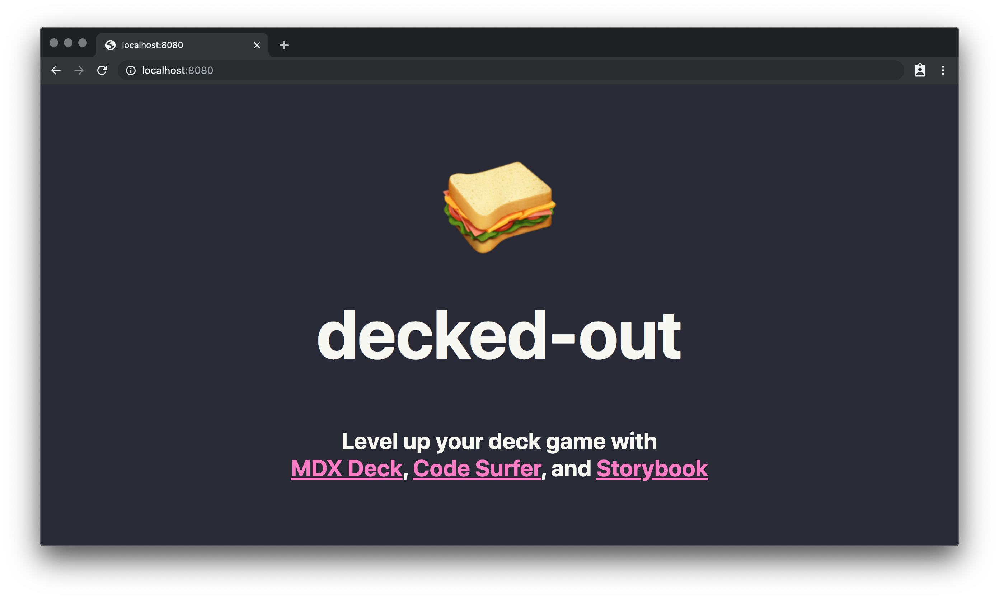

<!-- markdownlint-disable MD033 -->

<div align='center'>

# decked-out 🥪

Level up your deck game with [MDX Deck](https://github.com/jxnblk/mdx-deck/tree/v2.5.1), [Code Surfer](https://github.com/pomber/code-surfer/tree/v2.0.0-alpha.10), and [Storybook](https://github.com/storybookjs/storybook)



</div>

- [Why I made this 🤔](#why-i-made-this-)
- [Perks and such 🤩](#perks-and-such-)
- [How to use decked-out 🚀](#how-to-use-decked-out-)
- [Directory structure 📂](#directory-structure-)
- [Live demo 👀](#live-demo-)
- [Contributing 🥞](#contributing-)

## Why I made this 🤔

- Stop bootstrapping and import packages from scratch
- Uses the stable version of [mdx-deck](https://github.com/jxnblk/mdx-deck/tree/v2.5.1) and [code-surfer](https://github.com/pomber/code-surfer/tree/v2.0.0-alpha.10)
- Ready as a [GitHub template](https://github.com/grikomsn/decked-out) for future talks

## Perks and such 🤩

- Pre-made deck files, so you can get going
- [Storybook available for demoing components](https://decked-out.now.sh/storybook)
- Optimized for ZEIT Now deployment

## How to use decked-out 🚀

```bash
# Clone the repository
git clone https://github.com/grikomsn/decked-out.git

# Install dependencies and start development server
cd decked-out && yarn
yarn start

# Or start Storybook development server
cd decked-out/storybook && yarn
yarn start

# Deploy using ZEIT Now
now

# Or test local production build using now dev
now dev
```

## Directory structure 📂

```markup
├─ README.md
├─ components >
├─ deck.js
├─ now.json
├─ package.json
├─ slides >
│  ├─ 01-introduction.mdx
│  ├─ 02-content.mdx
│  ├─ 03-others.mdx
│  └─ 99-closing.mdx
├─ storybook >
│  ├─ package.json
│  ├─ stories
│  │  └─ Components.stories.js
│  └─ yarn.lock
├─ style.css
└─ yarn.lock
```

## Live demo 👀

<https://decked-out.now.sh>

## Contributing 🥞

Yes, please. Haven't got time to polish the readme and the codebase. Do submit an issue or even a pull request if you want.
